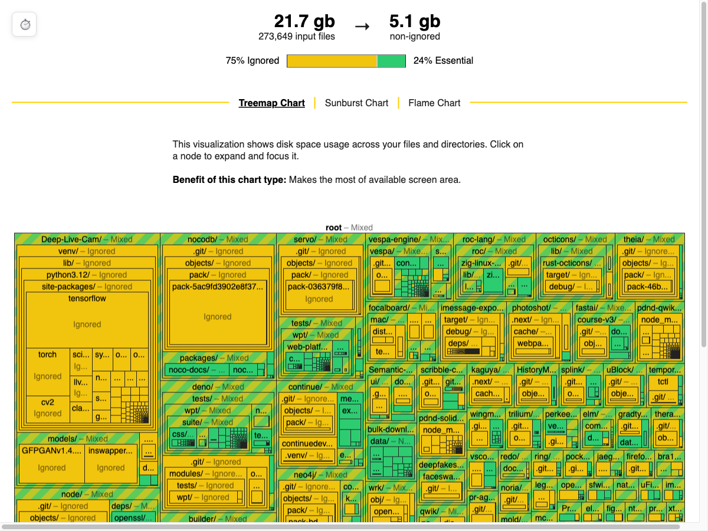
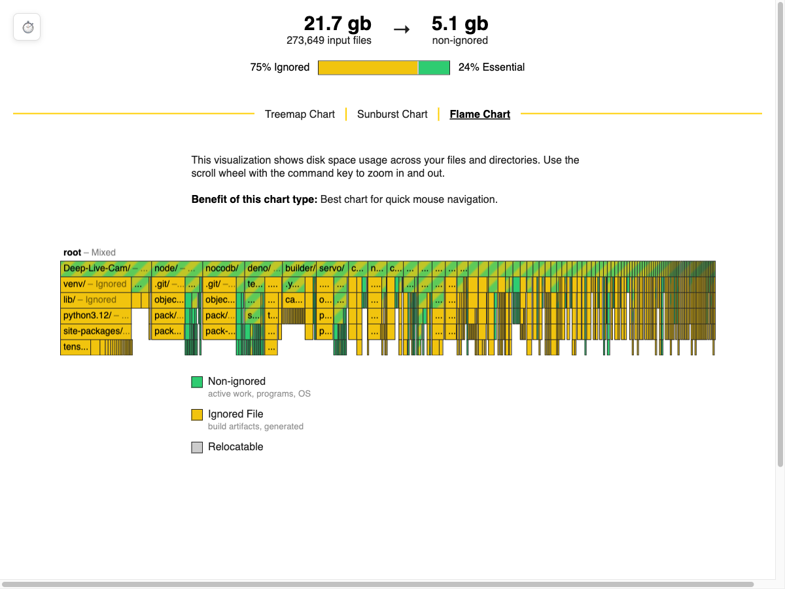

# duh - Disk Usage with .gitignore Awareness

`duh` helps you understand what's taking up space in your projects by showing disk usage with
.gitignore awareness. It combines a CLI tool with interactive browser visualizations. It works like
the classic `du` command but adds:

- Automatic .gitignore respect and hidden file skipping
- Built-in webserver for visual exploration through treemap, starburst, and flamegraph views
- Ability to see ignored vs non-ignored files separately in both CLI and browser visualizations.

The duh utility displays the file system block usage for each file argument and
for each directory in the file hierarchy rooted in each directory argument. If
no file is specified, the block usage of the hierarchy rooted in the current
directory is displayed. By default duh will respect gitignore rules and
automatically skip hidden files/directories.

> The name duh comes from frequently typing du -h for human-readable output. After all, I am human,
> so I want human output... duh! Since the name wasn't widely used in the software world, it seemed
> like a natural choice for a more human-friendly disk usage tool.

My personal use case is seeing all of my files. Sometimes programs are quite liberal in their use of
my home directory for caching and I want to spot the worst offenders.

```bash
duh --mode du --depth 7 --web ~/
```

| Size View                | Ignored vs Non-Ignored View  |
| ------------------------ | ---------------------------- |
|     |     |
|  |  |
|   |   |

## Quick Start

```bash
duh                     # analyze current directory
duh --depth 3           # limit directory depth
duh --mode non-ignored  # show only non-ignored files (default mode)
duh --mode ignored      # show only ignored files
duh --mode du           # show all files. Should produce identical output to `du`
duh --web               # open interactive visualization
```

My personal use case is seeing all of my files. Sometimes programs are quite liberal in their use of
my home directory for caching and I want to spot the worst offenders.

```bash
duh --mode du --depth 7 --web ~/
```

## Features

- **Familiar du-style CLI** with additional options for visualization
- **See three visualization types in your Browser:**
  - Treemap (hierarchical rectangles)
  - Starburst (radial hierarchy)
  - Flamegraph (stack visualization)
- **Lightweight web viewer** embedded ~40KB visualization app.
- **Fast ignore rule handling** even for many glob rules. It uses a modified version of ripgrep's gitignore
  parsing and handling. It is slower than it needs to be because of single threaded directory
  visitor. However the lack of parallelism is purely from lack of time investment, not technical
  difficulty.

## Learn More

- [Design Decisions](https://peoplesgrocers.com/en/projects/gitignore-aware-disk-usage-visualizer#design-decisions)
- [Similar Tools](https://peoplesgrocers.com/en/projects/gitignore-aware-disk-usage-visualizer/prior-art)

## Installation

duh is written in Rust, so you'll need to grab a
[Rust installation](https://www.rust-lang.org/) in order to compile it.
duh compiles with Rust 1.72.0 (stable) or newer. In general, duh tracks
the latest stable release of the Rust compiler.

duh uses esbuild to bundle and minify the visualization app.
Please ensure esbuild is installed by running either:

```
npm install esbuild    (local install)
- or -
npm install -g esbuild (global install)
```

If you have already installed esbuild, ensure it's available in your PATH

To build duh:

```bash
git clone https://github.com/PeoplesGrocers/disk-usage-cli
cd disk-usage-cli/crates/disk-usage-cli
cargo install --path .
duh --version
# Expect to see this printed to stderr: 0.1.0
```

### Running tests

duh is not tested. It needs both unit tests and integration
tests. To run the full test suite, use:

```
$ cargo test --all
```

## License Information

This project is primarily licensed under AGPL-3.0. Copyright 2024 Peoples Grocers LLC

This project incorporates code from third-party sources under different licenses:

1. `crates/patched_ignore/`: Contains code derived from ignore
   - Original code: Available under either MIT or Unlicense (user's choice)
   - All modifications: AGPL-3.0
2. `crates/disk-usage-cli/src/visualize/`: Contains code from esbuild.github.io
   - License unknown.

## Third-Party Code Notice for patched_ignore

The base code in crates/patched_ignore is derived from ignore which is dual-licensed under MIT or Unlicense (user's choice). Our modifications to this code are licensed under AGPL-3.0. When using this crate:

1. The original code portions remain available under either MIT or Unlicense (your choice)
2. Our modifications are only available under AGPL-3.0
3. The combined work (original + modifications) must be used under AGPL-3.0 terms
